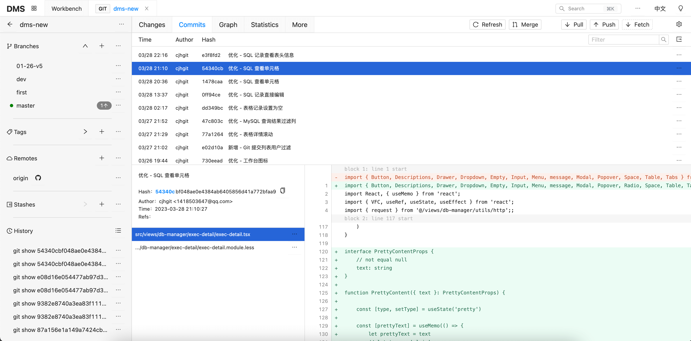
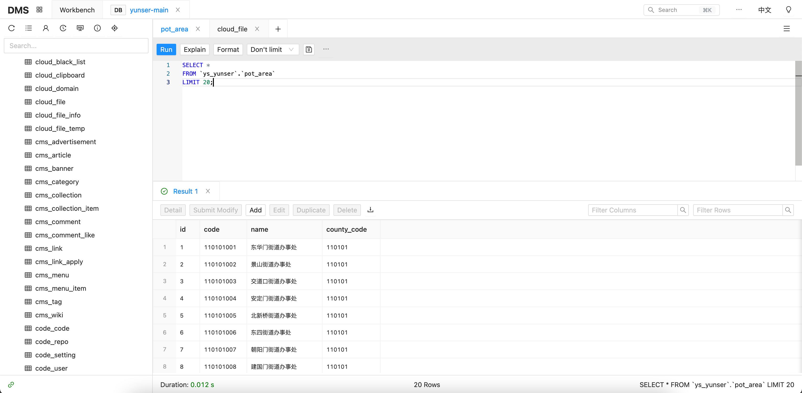

# DMS Web

[English](./README.md) | 简体中文


DMS 前端界面代码。

后端代码见 [@yunser/dms-node](https://github.com/yunser/dms-node)


# 项目简介

DMS 是一个基于 Node.js 和 Web 技术栈的开发辅助工具，致力于用技术去解决开发工作中遇到的工具问题。

目前已实现的功能包括但不限于：

* Git 项目管理
* MySQL 管理
* Redis 管理
* SSH
* SFTP
* Swagger 管理
* OSS/S3 客户端
* Mongo 管理
* TCP 调试
* HTTP 调试
* MQTT 调试
* WebSocket 调试
* 日志管理


## 相关截图






# 快速安装使用

```shell
npm i @yunser/dms-cli -g
dms web
```


# 开发

```shell
git clone https://github.com/yunser/dms-web.git
cd dms-web
npm i
npm run dev
```


## 协议

禁止商用。
