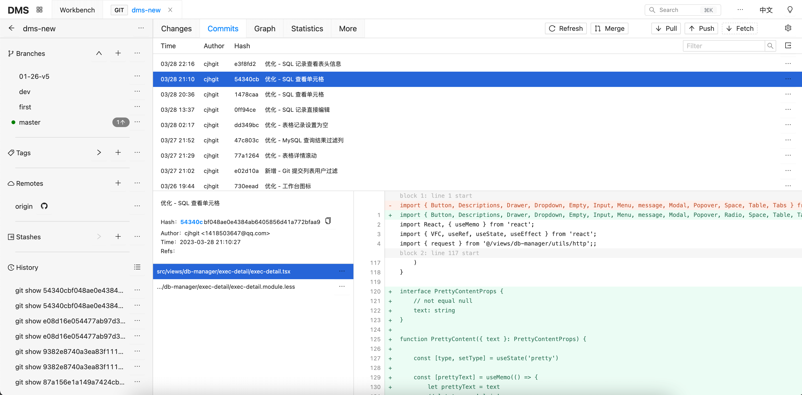
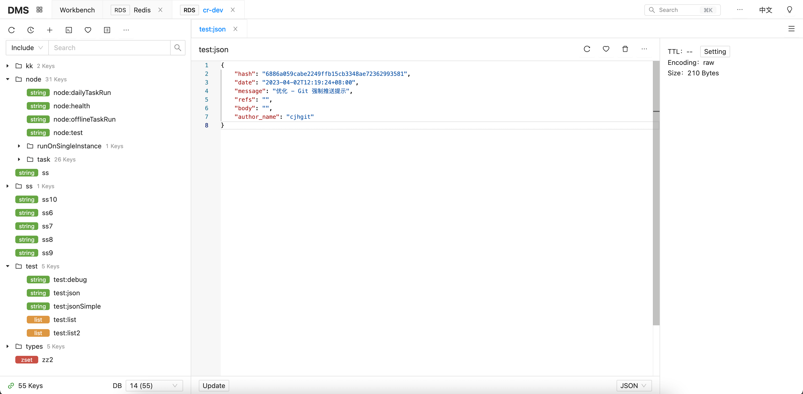

# DMS Web

English | [简体中文](./README-zh_CN.md)


DMS Front-end Interface Code.

See [@yunser/dms-node](https://github.com/yunser/dms-node) for the backend code.


# Project Introduction

DMS is a development assistance tool based on Node.js and Web technology stack, dedicated to using technology to solve tool problems encountered in development work.

Currently implemented features include but are not limited to:

* Git project management
* MySQL management
* Redis management
* SSH
* SFTP
* Swagger management
* OSS/S3 client
* Mongo management
* TCP debugging
* HTTP debugging
* MQTT debugging
* WebSocket debugging
* Log management


## Related Screenshots







# Quick installation and use

```shell
npm i @yunser/dms-cli -g
dms web
```


# Development

```shell
git clone https://github.com/yunser/dms-web.git
cd dms-web
npm i
npm run dev
```


## License

Commercial use is prohibited.
